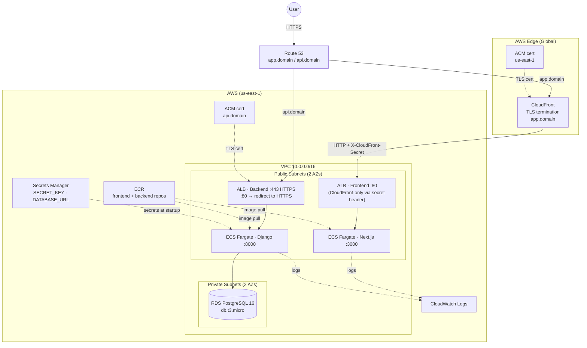

# Process summary: How I used AI to develop in ~3 hours following best practices and high quality standards

1. Read through the instructions carefully and watched the video requirements. Wrote down important notes to instruct the agents.

2. Downloaded relevant skills for the project:
- Django patterns, security, tdd, verification.
- Next JS Best practices
- Docker best practices

3. Connected MCPs for Figma. Web-based MCP has a limit on the amount of request for free users, I had to use a community MCP server running in local connected as a developer plugin in Figma. This worked great to surf the design.

4. Edited the figma frames to be AI-ready. E.g. instead of "Macbook Pro 16 - 1" -> "Login Page" / "Detail Page" / "Dashboard Page"

5. Developed frontend: Asked claude to use NextJS best practices skill to implement the frames in my figma design, without considering backend, using in-memory dummy data. Asked for refactoring for: using tailwind css. As the frontend defines the data that is required, this would be a great foundation for the AI to understand the required backend endpoints and data models. Some minor UI adjustments were made by hand.

6. Developed backend: I asked Claude to draft a plan of the required, use django best practices skills for DRF, plan on the models and endpoints required based on the frontend dummy data files. I asked to implement login using django but modify default auth to use email instead of username. Asked for a plan to verify before implementation. Asked minor modifications as well as adding a seeding script to pre-fill db with demo data. 

7. I asked Claude to document the backend endpoints, data models and authentication details into the readme (but I usually use a dedicated folder of markdowns as references for agents). Asked to use it as reference for modifying fronted to connect to the backend instead of using dummy data file.

8. Asked Claude to dockerize application following docker best practices (skill) and generate a compose file for easy setup for local development. 

9. Once I tested end-to-end the application manually and verified the most important code I used Claude to generate test cases which are critically important for continuing the work using AI. These would allow us to make changes in the app with the confidence that previous work is fully operational (checkpointing). I asked to create unit tests for backend including coverage analysis. Same for frontend including unit-tests and end-to-end tests using playwright.


| Date | Time (UTC) | Duration | Topics |
|------|-----------|----------|--------|
| Mar 18 (evening) | 02:00–03:10 | ~1h 10m | Frontend scaffolding from Figma design (Login, Dashboard, Note Detail), Next.js setup, `.gitignore` |
| Mar 18 (cont.) | 03:10–03:54 | ~44m | UI per page refinement (parallel agents per page), Flexbox/Grid refactor, Tailwind migration, Login hydration fix, PNG image fix |
| Mar 19 (early AM) | 03:54–04:24 | ~30m | Django DRF backend (notes, categories, auth), API client in frontend, Docker + Postgres, tests, bug fixes |
| Mar 19 (evening) | 22:17–22:44 | ~26m | Frontend unit + Playwright e2e testing setup, README update |

  **Total dev time: ~2h 50m**


10. Designed and refined a deployment strategy using Claude. Asked for changes based on my personal experience specially around SSL termination, ECS usage optimization and database management.

11. Finally performed a code review using Codex, for quality issues and maintainability. Generated a code review report with some recommendations I implemented.


# Key design and technical decisions

**Frontend-first development.** The first frontend iteration was built against in-memory dummy data (`lib/store.tsx`). That forced the data model to be defined by what the UI actually needed first; the backend was then shaped to match that contract rather than the other way around.

**Email-based auth, no username field.** Django's default auth uses `username`. `CustomUser` replaces that with `email` as `USERNAME_FIELD`, which matches the login form and stored user model. There is no persisted username field in the system.

**Category slug as primary key.** Categories use a `SlugField` as PK (`"school"`, `"personal"`, `"random-thoughts"`) instead of an integer. The frontend and backend therefore share the same string identifier, and the `CATEGORIES` constant in `frontend/lib/types.ts` can be used directly without an extra category lookup API for the current UI.

**PATCH only, no PUT.** `NoteViewSet` disables PUT (`http_method_names` excludes it). The autosave in `NoteDetailPage` always sends a partial update with only changed fields, so partial updates are the only supported write pattern.

**Client-side category filtering.** The dashboard fetches all notes once and filters in-browser by `activeCategory`. The backend supports `?category=<slug>` filtering too, but the current frontend does not use it; all notes are loaded up front and the sidebar counts are derived from that same array.

**Autosave with debounce.** The note editor debounces text saves by 400ms and merges pending text edits with immediate category changes before sending PATCH requests. `updated_at` is refreshed from the server response after each successful save, so "Last Edited" reflects the actual server timestamp rather than a client-side estimate.

**Route pages are thin wrappers.** Next.js App Router pages in `app/` are minimal wrappers that render feature components. Most logic, state, and effects live in `components/`, which keeps the route files simple and the component logic directly testable.

**Tests as checkpoints.** Tests were added after the core feature was working and manually verified end to end. Their primary purpose is regression protection for continued development, especially when iterating quickly with AI assistance.

**Playwright mocks the API, not the server.** E2E tests use `page.route()` to intercept fetch calls at the browser level. That keeps them fast and deterministic while still exercising the full frontend stack, including routing and client-side state.


# Agent documentation

Precise reference docs for implementing features or modifying the codebase:

| Document | Contents |
|----------|----------|
| [docs/backend.md](./docs/backend.md) | Stack, auth flow, key conventions and architectural decisions, env vars |
| [docs/api.md](./docs/api.md) | Every endpoint: method, path, request/response shapes, frontend API client usage |
| [docs/data-models.md](./docs/data-models.md) | Backend models, frontend types, backend↔frontend field name mapping |
| [docs/frontend.md](./docs/frontend.md) | Routes, key frontend patterns (auth guard, autosave, category filtering) |
| [docs/testing.md](./docs/testing.md) | How to run tests, critical mocking gotchas, test patterns |

---

# Notes Taking App

A full-stack notes app. Next.js 14 frontend connected to a Django REST Framework backend, JWT authentication, and PostgreSQL — fully containerised with Docker Compose.

```
notes-taking/
├── frontend/           # Next.js 14 App Router (TypeScript + Tailwind)
├── backend/            # Django 5 + DRF + SimpleJWT
├── docker-compose.yml  # Local development
└── docs/               # Agent reference documentation
```


## Docker (local dev)

**Prerequisites:** Docker and Docker Compose.

```bash
# Start both services with hot-reload
docker compose up --build

# Frontend → http://localhost:3000
# Backend  → http://localhost:8000
```

On first run, run migrations, create a super user and seed the database (wait for containers to be healthy):

```bash
docker compose exec backend python manage.py migrate
docker compose exec backend python manage.py createsuperuser
docker compose exec backend python manage.py seed
```

This creates `demo@example.com` / `demo1234` and sample notes.

Postgres data is stored in the `pgdata` named volume and persists across restarts. To reset it:

```bash
docker compose down -v   # removes containers and the pgdata volume
```

**Common commands:**

```bash
docker compose up            # start (no rebuild)
docker compose up --build    # rebuild images and start
docker compose down          # stop and remove containers
docker compose logs -f       # follow logs from all services
docker compose logs -f backend  # follow backend logs only
```

Both services mount the local source directory, so code changes reload automatically — no rebuild needed during development.

---

## Frontend

**Stack:** Next.js 14, TypeScript, Tailwind CSS

**Routes:**
| Path | Component |
|------|-----------|
| `/` | Redirects to `/login` |
| `/login` | `LoginPage` (signin) — email/password form |
| `/signup` | `LoginPage` (signup) — email/password form |
| `/dashboard` | `DashboardPage` — note grid + category sidebar |
| `/notes/[id]` | `NoteDetailPage` — autosaving note editor |

**Running:**
```bash
cd frontend
npm install
npm run dev        # http://localhost:3000
```

**Testing:**

Unit tests (Jest + React Testing Library):
```bash
cd frontend
npm test                 # run all unit tests
npm run test:coverage    # with coverage report
npm run test:watch       # watch mode
```

Unit tests via Docker Compose:
```bash
docker compose exec frontend npm test
docker compose exec frontend npm run test:coverage
```

Integration tests (Playwright — requires the dev server running):
```bash
cd frontend
npm run test:e2e      # headless
npm run test:e2e:ui   # interactive UI mode
```

Integration tests via Docker Compose:
```bash
docker compose exec frontend npm run test:e2e
docker compose exec frontend npm run test:e2e:ui
```

**Unit tests** (`npm test`) — 49 tests across 6 suites:

| File | What's tested |
|------|---------------|
| `__tests__/lib/utils.test.ts` | `formatDate` (today/yesterday/older), `formatLastEdited`, `generateId` uniqueness |
| `__tests__/lib/types.test.ts` | `CATEGORIES` shape/count, `getCategoryById` for all 3 categories, fallback display category for `null` |
| `__tests__/lib/api.test.ts` | `getAccessToken`/`setTokens`/`clearTokens`, `login` (success + error cases), `getNotes`/`createNote`/`getNote`/`patchNote` with mocked `fetch`, preserves `null` categories from the API |
| `__tests__/components/LoginPage.test.tsx` | Renders signin/signup modes, navigation between pages, error on failed login, redirect on success, loading state, already-authenticated redirect |
| `__tests__/components/DashboardPage.test.tsx` | Auth redirect, note rendering, sidebar filtering, empty state, create note flow |
| `__tests__/components/NoteDetailPage.test.tsx` | Auth redirect, nullable category fallback, debounced autosave, merged pending edits, back navigation |

**Integration tests** (`npm run test:e2e`) — 22 passing Playwright tests across 3 spec files, API mocked via `page.route()`:

| File | What's tested |
|------|---------------|
| `e2e/login.spec.ts` | Form renders, invalid credentials error, successful redirect, loading state, navigation to signup page |
| `e2e/dashboard.spec.ts` | Notes display, category sidebar/filter, empty state, create new note, unauthenticated redirect |
| `e2e/note-detail.spec.ts` | Title/content display, category dropdown open/close/change, editing, back navigation, unauthenticated redirect |

**Coverage** (`npm run test:coverage`):

| File | Stmts | Branch | Funcs | Lines |
|------|-------|--------|-------|-------|
| `DashboardPage.tsx` | 91.17% | 85.71% | 78.57% | 93.33% |
| `LoginPage.tsx` | 100% | 84% | 100% | 100% |
| `NoteDetailPage.tsx` | 94.87% | 89.47% | 82.14% | 94.28% |
| `api.ts` | 87.75% | 73.91% | 100% | 93.02% |
| `types.ts` | 88.88% | 75% | 100% | 100% |
| `utils.ts` | 100% | 100% | 100% | 100% |
| **All files** | **93.6%** | **83.13%** | **88.23%** | **95.38%** |

Full frontend reference → [docs/frontend.md](./docs/frontend.md)

---

## Backend

**Stack:** Django 5, Django REST Framework, SimpleJWT, django-cors-headers, django-filter, PostgreSQL

### Setup

```bash
docker compose exec backend python manage.py migrate
docker compose exec backend python manage.py seed
```

Copy `.env.example` to `.env` to override defaults. No `.env` file is required for local development.

**Testing:**

```bash
docker compose exec backend uv run coverage run --source='apps' manage.py test
docker compose exec backend uv run coverage report -m
```

48 tests. Coverage:

| File | Cover |
|------|-------|
| `apps/notes/models.py` | 100% |
| `apps/notes/views.py` | 100% |
| `apps/notes/serializers.py` | 100% |
| `apps/notes/filters.py` | 100% |
| `apps/users/models.py` | 100% |
| `apps/users/views.py` | 100% |
| `apps/users/serializers.py` | 93% |
| `apps/notes/management/commands/seed.py` | 0% (management command, not unit tested) |
| **Total** | **95%** |

---

### Authentication

JWT-based. Login returns an `access` token (1 hour) and a `refresh` token (7 days). Send on every authenticated request:

```
Authorization: Bearer <access_token>
```

Tokens are stored in `localStorage` by the frontend. On 401, tokens are cleared and the user is redirected to `/`. → Full details in [docs/api.md](./docs/api.md)

### Endpoints

| Method | Path | Auth | Description |
|--------|------|------|-------------|
| POST | `/api/auth/login/` | No | Returns `{ access, refresh }` |
| POST | `/api/auth/token/refresh/` | No | Returns new `{ access }` |
| GET | `/api/categories/` | Yes | List all categories |
| GET | `/api/notes/` | Yes | List user's notes (`?category=<slug>`) |
| POST | `/api/notes/` | Yes | Create a note |
| GET | `/api/notes/{id}/` | Yes | Get a note |
| PATCH | `/api/notes/{id}/` | Yes | Partial update |
| DELETE | `/api/notes/{id}/` | Yes | Delete |

Full request/response shapes, error formats, and frontend API client reference → [docs/api.md](./docs/api.md)

---

## Deployment — AWS

### Architecture



**Services:**

| Service | Type | Size | Notes |
|---------|------|------|-------|
| DNS | Route 53 | — | `app.<domain>` → CloudFront, `api.<domain>` → backend ALB |
| CDN / TLS | CloudFront | PriceClass_100 | SSL termination at edge; static assets cached up to 1 year |
| SSL Certs | ACM | 2 certs | `app.<domain>` in us-east-1 for CloudFront; `api.<domain>` in deployment region |
| Frontend | ECS Fargate | 0.25 vCPU / 512 MB | Next.js server; only reachable via CloudFront secret header |
| Backend | ECS Fargate | 0.25 vCPU / 512 MB | Django + Gunicorn; HTTPS on port 443 |
| Database | RDS PostgreSQL 16 | db.t3.micro | Private subnet, not internet-facing |
| Images | ECR | 2 repos | Lifecycle policy keeps last 5 tags |
| Secrets | Secrets Manager | 1 secret | `SECRET_KEY` + `DATABASE_URL` |
| Logs | CloudWatch | 7-day retention | Per service log group |

ECS tasks run in **public subnets** with `assign_public_ip = true` to pull images from ECR without a NAT Gateway (saves ~$30/month). The frontend ALB is locked to CloudFront traffic only via a shared secret header (`X-CloudFront-Secret`). The backend ALB terminates HTTPS directly with an ACM certificate. RDS sits in **private subnets** — unreachable from the internet.

---

### Terraform

Infrastructure is defined in `infrastructure/` using Terraform.

```
infrastructure/
├── main.tf              # Provider (+ us-east-1 alias for CloudFront ACM)
├── variables.tf         # All input variables
├── outputs.tf           # HTTPS URLs, ECR URLs, RDS endpoint
├── vpc.tf               # VPC, subnets, IGW, route tables
├── security_groups.tf   # SGs for ALB, ECS, RDS
├── ecr.tf               # Container registries + lifecycle policies
├── rds.tf               # PostgreSQL instance
├── acm.tf               # ACM certificates (api + app subdomains)
├── route53.tf           # DNS records + ACM validation CNAMEs
├── cloudfront.tf        # CloudFront distribution (frontend TLS termination)
├── alb.tf               # Two ALBs + target groups + listeners (HTTPS on backend)
├── ecs.tf               # Cluster, task definitions, services
├── iam.tf               # ECS task execution role
├── secrets.tf           # Secrets Manager for Django secrets
└── terraform.tfvars.example
```

**Prerequisites:** AWS CLI configured, Terraform ≥ 1.5, Docker. A hosted zone for your domain must already exist in Route 53.

```bash
cd infrastructure
cp terraform.tfvars.example terraform.tfvars
# Edit terraform.tfvars with real values

terraform init
terraform plan
terraform apply
```

After `apply`, Terraform outputs the HTTPS URLs (`https://app.<domain>`, `https://api.<domain>`) and ECR repository URLs. ACM certificate validation is automatic via the DNS records Terraform creates — it may take a few minutes on first apply.

---

### Deploy workflow

**1. Create a production Django settings file** (`backend/config/settings/production.py`):

```python
from .base import *  # noqa

DEBUG = False

DATABASES = {
    'default': env.db('DATABASE_URL'),
}

CORS_ALLOWED_ORIGINS = env.list('CORS_ALLOWED_ORIGINS')
```

**2. Build and push images to ECR:**

```bash
# Authenticate Docker with ECR
aws ecr get-login-password --region us-east-1 \
  | docker login --username AWS --password-stdin <ECR_URL>

# Backend
docker build -t notes-taking-backend ./backend
docker tag notes-taking-backend:latest <ECR_BACKEND_URL>:latest
docker push <ECR_BACKEND_URL>:latest

# Frontend — pass the backend URL from terraform output at build time
docker build \
  --build-arg NEXT_PUBLIC_API_URL=http://<BACKEND_ALB_DNS> \
  -t notes-taking-frontend ./frontend
docker tag notes-taking-frontend:latest <ECR_FRONTEND_URL>:latest
docker push <ECR_FRONTEND_URL>:latest
```

**3. Run database migrations:**

```bash
# One-off ECS task to migrate + seed
aws ecs run-task \
  --cluster notes-taking \
  --task-definition notes-taking-backend \
  --launch-type FARGATE \
  --overrides '{"containerOverrides":[{"name":"backend","command":["python","manage.py","migrate"]}]}' \
  --network-configuration "awsvpcConfiguration={subnets=[<SUBNET_ID>],securityGroups=[<SG_ID>],assignPublicIp=ENABLED}"
```

**4. Force a new ECS deployment:**

```bash
aws ecs update-service --cluster notes-taking --service notes-taking-backend --force-new-deployment
aws ecs update-service --cluster notes-taking --service notes-taking-frontend --force-new-deployment
```

> **Note on `NEXT_PUBLIC_API_URL`:** Next.js bakes this value into the client bundle at build time. Build the frontend image *after* `terraform apply` so the backend ALB DNS name is available. For a stable URL across redeployments, point a custom domain at the ALBs via Route 53 and use that domain instead.

---

### Infrastructure limitations

This setup is intentionally minimal — enough to run the application in production securely, but **not designed to scale without modifications**. Before increasing traffic or load, consider the following:

| Area | Current config | What to change |
|------|---------------|----------------|
| **RDS availability** | Single AZ | Add `multi_az = true` to `rds.tf` to survive an AZ failure |
| **RDS backups** | 7-day retention | Increase `backup_retention_period` to 30+ days |
| **ECS task size** | 0.25 vCPU / 512 MB per service | Increase `cpu` / `memory` in `ecs.tf` under sustained load |
| **ECS desired count** | 1 task per service | Increase `desired_count` or add autoscaling for high availability |
| **CloudWatch logs** | 7-day retention | Increase `retention_in_days` in `ecs.tf` for longer incident history |
| **No WAF** | CloudFront has no WAF rules | Attach `aws_wafv2_web_acl` to the CloudFront distribution for rate limiting and IP blocking |
| **No autoscaling** | Fixed task count | Add `aws_appautoscaling_target` + policies to ECS services |
| **Single region** | All resources in one region | Multi-region DR requires additional planning |
